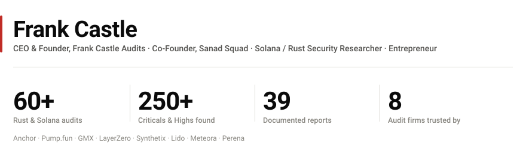
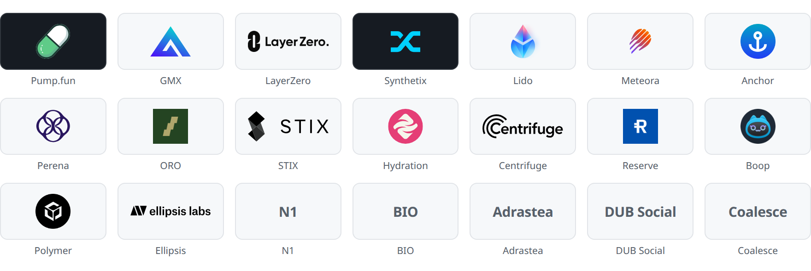
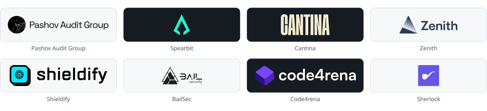
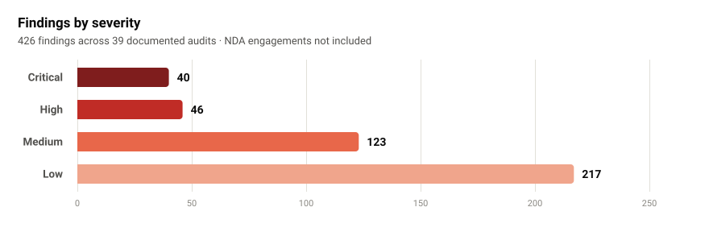

<picture>
  <source media="(prefers-color-scheme: dark)" srcset="assets/hero-dark.svg">
  
</picture>

I'm **Frank Castle**, CEO and founder of **[Frank Castle Audits](https://www.frankcastle.xyz/)**, co-founder of **[Sanad Squad](https://sanadsquad.com)**, and one of the best **Solana security researchers** working today. I audit **Rust** smart contracts across **Solana**, **Polkadot** and **Cosmos (CosmWasm)**: Anchor programs, PDAs, CPI boundaries, SPL / Token-2022, AMMs, bonding curves, vaults and staking.

**60+ private audits.** **250+ criticals and highs** found across Pump.fun, GMX, LayerZero, Synthetix, Lido, Meteora, Perena and ORO. Delivered through **Pashov Audit Group, Spearbit, Cantina, Zenith, Shieldify and BailSec**, and solo.

Beyond auditing I build security products: **Solana Audit Arena**, **safe-solana-builder**, a **Solana CTF**, a **researcher roadmap**, and **AI agents + Web3 AI tooling** currently in development.

## Protocols secured

<picture>
  <source media="(prefers-color-scheme: dark)" srcset="assets/protocols-dark.png">
  
</picture>

## Delivering through

<picture>
  <source media="(prefers-color-scheme: dark)" srcset="assets/firms-dark.png">
  
</picture>

## Findings by severity

<picture>
  <source media="(prefers-color-scheme: dark)" srcset="assets/severity-dark.svg">
  
</picture>

| Severity | Count |
|:---|---:|
| Critical | 40 |
| High | 46 |
| Medium | 123 |
| Low | 217 |
| **Total** | **426** |

This chart covers only the **39 audits with published reports** in **[public-audits](https://github.com/Frankcastleauditor/public-audits)**. Across all 60+ engagements, including NDA work that can't be published, the running total is **250+ criticals and highs**.

## Building

| Project | What it is |
|:---|:---|
| **[Solana Audit Arena](https://www.frankcastle.xyz/)** | Competitive verification platform for Solana security researchers |
| **safe-solana-builder** | Production tooling and template engine for safer Solana programs |
| **[Solana CTF](https://github.com/Frankcastleauditor/Solana_CTF)** | Hands-on exploit practice for Solana program vulnerabilities |
| **Researchers Roadmap** | A 6-month curriculum for becoming a Solana security researcher |
| **[Sanad Squad](https://sanadsquad.com)** | Co-Founder |
| **AI agents & Web3 AI tooling** | In development |

## Competitive results

| Contest | Platform | Placement | Reward |
|:---|:---|:---|---:|
| HydraDX Omnipool | Code4rena | 🥈 **2nd** | $21,555 |
| Centrifuge | Cantina | **4th** | $5,300 |
| Centrifuge | Code4rena | **11th** | $1,155 |

## Writing

- [The Seed Set Is Your Schema: Reading PDA Identity Bugs in Anchor](https://www.frankcastle.xyz/)
- [One Account Type to Rule Them All: Anchor V2's Slab and the Duplicate-Mutable Check](https://www.frankcastle.xyz/)
- [Solana CPI scope mismatching leading to DoS](https://x.com/0xcastle_chain/status/2025957271230894356)
- [MintClose extension risk](https://x.com/0xcastle_chain/status/1850656223403593986)

## Work with me

Taking Solana and Rust audit engagements.

**[frankcastle.xyz](https://www.frankcastle.xyz/)** · **[X](https://x.com/0xcastle_chain)** · **[Telegram](https://t.me/castle_chain)** · **[Discord](https://discordapp.com/users/1119172287330004992)** · **[Email](mailto:frank@frankcastle.xyz)**
